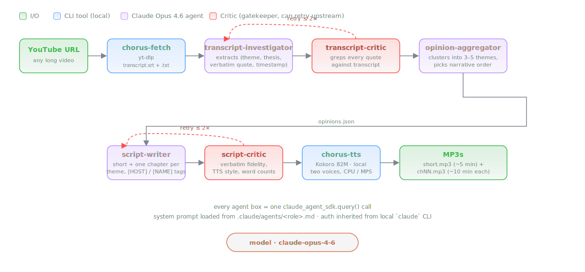

# Oratio

**Turn a 60-minute YouTube lecture — or an entire thinker's corpus — into a two-voice podcast, written by agents, rendered locally, running entirely off your Claude subscription.**

Oratio is a single CLI with two modes:

- **URL mode** — one YouTube URL → short (~5 min) + themed long chapters (~10 min each).
- **Name mode** — a person's name → multi-keyword YouTube search → curated 3–5 talks → chronological "audio biography" with per-era chapters and transitions that track how their views evolved.

A Claude Opus 4.6 agent pipeline extracts verbatim opinions, drafts production-grade scripts, then Kokoro 82M TTS renders them in two voices — a narrator plus the subject, speaking their own words verbatim. No `ANTHROPIC_API_KEY`: the Claude Agent SDK shells out to your local `claude` binary and inherits Pro/Max auth.

[](#license)
[](https://www.python.org)
[](https://docs.claude.com/en/docs/claude-code)
[](https://github.com/hexgrad/kokoro)
[](https://github.com/yt-dlp/yt-dlp)

## Listen to an example

A 4.9-minute short produced end-to-end by the pipeline from a 64-minute RLC 2025 keynote by **Dale Schuurmans**, *Language Models and Computation*. No human edits inside the run.

<p align="center">
  <video src="https://github.com/user-attachments/assets/9eefc4ec-4dfe-4c29-8719-c23311e3d9ad" controls width="480"></video>
</p>

🎧 **[Download the MP3](https://raw.githubusercontent.com/zhuconv/oratio/main/examples/dale_schuurmans_llms_as_universal_computers.mp3)** · 📄 **[Read the script](examples/dale_schuurmans_llms_as_universal_computers.txt)**

The `.txt` is the raw `[HOST]` / `[DALE]` tagged script the agents wrote. The MP3 is what Kokoro did with it.

## Quickstart

Pick whichever install style matches how you work:

### One-shot: uvx (no clone, no sync)

```bash
brew install espeak-ng ffmpeg
npm install -g @anthropic-ai/claude-code && claude    # one-time login
uvx oratio "https://www.youtube.com/watch?v=<ID>"     # single video
uvx oratio "Dale Schuurmans"                          # or a person's name
uvx oratio-doctor                                     # self-check deps
```

### Inside Claude Code: install as a plugin

```
/plugin install zhuconv/oratio
/oratio https://www.youtube.com/watch?v=<ID>
/oratio "Dale Schuurmans" --max-videos 5
```

The plugin ships the five single-video agents plus the four name-mode agents and the `/oratio` skill, so the full pipeline runs inside any Claude Code session that has the `oratio` Python package installed (via `uv tool install oratio` or `pip install oratio`).

### Traditional clone-and-uv

```bash
brew install espeak-ng ffmpeg
npm install -g @anthropic-ai/claude-code && claude
git clone https://github.com/zhuconv/oratio && cd oratio
uv sync
uv run oratio "https://www.youtube.com/watch?v=<ID>"
open output/<Subject>/<date>__<id>__<slug>/short/short.mp3
```

That's it. One short MP3, plus one long MP3 per chapter (themes in URL mode, eras in name mode).

## Why it exists

Long-form interviews and academic talks are the highest-signal AI content on the internet — and the hardest to consume. You rarely have 90 free minutes. You often do have 5.

Two things make Oratio more than "another summarizer":

1. **The agents call your local `claude` CLI.** No API key, no billing, no token juggling — the Agent SDK spawns the logged-in binary and agent turns bill against your Pro or Max subscription. The orchestrator is just five `query()` calls stitched together with a critic loop.
2. **Quotes are preserved verbatim, in the subject's voice.** Every line tagged `[DALE]` in the script is a byte-for-byte substring of the transcript. A dedicated critic agent greps every quote against `transcript.txt` and blocks the pipeline if even one word drifts. Then Kokoro renders those quotes in a different voice from the narrator, so "what the host says about Dale" and "what Dale actually said" are audibly distinct.

The result is something closer to a written essay read aloud than a robotic recap — and because the quotes are audited, you can trust it more than a summary.

## Pipeline

<p align="center">
  
</p>

Every agent box is a single `claude_agent_sdk.query()` call with a role-specific system prompt loaded from `agents/<role>.md` at the repo root. Critics can send work back to their upstream agent for one retry before the orchestrator gives up and proceeds.

Name mode wraps the single-video pipeline with three extra agents — `interview-finder`, `era-aggregator`, `corpus-script-writer/critic` — plus a parallel per-video investigator fan-out. The `era-aggregator` is the only agent that sees quotes from more than one talk at once; it's also the only one allowed to speculate about *how* a view changed. It never speculates about *why* — if the subject never stated a reason for a shift, the corpus critic blocks any chapter that invents one.

## Case studies

| Source | Length | Kind | Result |
|---|---|---|---|
| **Dale Schuurmans** — RLC 2025 keynote, *Language Models and Computation* | 64 min | Academic lecture | 5 MP3s, ~42 min total. Zero human edits inside the pipeline. [Listen.](https://raw.githubusercontent.com/zhuconv/oratio/main/examples/dale_schuurmans_llms_as_universal_computers.mp3) |
| **Mo Gawdat** — interview on AI, UBI, and the job market | 40 min | Pop interview | 5 MP3s, ~29 min total. Validated end-to-end; assembled before the orchestrator landed. |

Two wildly different source genres, same pipeline, coherent output. That's the main thing this POC was proving.

## Setup in detail

<details>
<summary>Expand for prerequisites, Python, auth</summary>

**System (macOS tested):**

```bash
brew install espeak-ng ffmpeg
```

**Claude Code CLI — the Agent SDK spawns this and inherits its login.** No `ANTHROPIC_API_KEY` is used anywhere in the orchestrator. Even if you have one exported in your shell, the orchestrator clobbers it to an empty string in the subprocess env it hands to `claude`, so every agent turn bills against your Pro/Max subscription. A `note:` is printed at run start if a key is detected.

```bash
npm install -g @anthropic-ai/claude-code
claude        # one-time login; Pro/Max covers all agent calls
```

**Python 3.11–3.12:**

```bash
uv sync       # installs yt-dlp, kokoro, claude-agent-sdk, torch, etc.
```

**First Kokoro run** downloads ~330 MB of model weights from Hugging Face. After that it runs fully offline on CPU or Apple Silicon MPS.

</details>

## Usage

### URL mode — one video

```bash
uv run oratio "https://www.youtube.com/watch?v=E0Q96IKXx6Q"
```

Output (subject-indexed, date-sortable, re-runnable):

```
output/
└── Dale_Schuurmans/
    └── 2025-08-25__yGLoWZP1MyA__dale_schuurmans_language_models/
        ├── metadata.json
        ├── transcript.srt / transcript.txt
        ├── opinions.raw.json              # investigator
        ├── transcript_critic_report.json
        ├── opinions.json                  # aggregator — themes, subject_gender
        ├── script_critic_report.json
        ├── short/{script.txt, short.mp3}  # ~800 words, ~5 min
        └── long/
            ├── ch01_<slug>_script.txt     # ~1500 words / ~10 min per chapter
            ├── ch01_<slug>.mp3
            └── ...
```

A run stages in `output/_staging/<video_id>/` until the aggregator determines `subject_name`, then the orchestrator moves it to its final home.

### Name mode — a thinker's corpus

```bash
uv run oratio "Dale Schuurmans" --max-videos 5
```

Behind the scenes:

1. `oratio-find` queries YouTube for `<name> keynote`, `<name> interview`, `<name> podcast`, `<name> talk`, `<name> lecture`, `<name> fireside`, dedupes, applies a 20-minute minimum, enriches with upload dates → `candidates.json`.
2. The `interview-finder` agent filters to formal talks **by** the subject (excludes commentary, clips, wrong-person matches) → `videos.json`.
3. Per-video `transcript-investigator + transcript-critic` runs in parallel across the shortlist.
4. The `era-aggregator` groups opinions into 2–4 chronological eras and identifies transitions — including cases where the subject's stance changed without ever stating *why*, which are marked honestly rather than fabricated.
5. The `corpus-script-writer` writes a chronological 5-minute overview plus one era chapter per era, each opening with a transition passage from the previous era.
6. Kokoro renders everything.

Output:

```
output/
└── Dale_Schuurmans/
    ├── _corpus/
    │   ├── candidates.json              # oratio-find raw search
    │   ├── videos.json                  # interview-finder verdict
    │   ├── opinions_index.json
    │   ├── evolution.json               # era-aggregator — eras, transitions, stable themes
    │   ├── script_critic_report.json
    │   └── <date>__<video_id>__<slug>/  # per-video artifacts (transcript, opinions.raw.json, ...)
    ├── short/{script.txt, overview.mp3} # chronological overview, ~5 min
    └── long/
        ├── era01_<slug>_script.txt      # one chapter per era, ~10 min each
        ├── era01_<slug>.mp3
        ├── era02_<slug>.mp3
        └── era03_<slug>.mp3
```

Re-running with `--skip-search` reuses `candidates.json` and `videos.json`; re-running with the whole corpus already on disk resumes from wherever the pipeline stopped last time.

### Flags

```bash
uv run oratio <URL_or_name> [--model claude-opus-4-6]
                            # URL mode:
                            [--skip-fetch]         # reuse existing transcript
                            # name mode:
                            [--max-videos 5]       # cap on videos selected
                            [--min-duration 1200]  # min seconds per candidate
                            [--skip-search]        # reuse candidates.json + videos.json
                            # both:
                            [--skip-synth]         # stop before Kokoro
```

### Single-stage CLIs

Every stage is a standalone command:

```bash
uv run oratio-fetch <URL> -o output/                          # transcript only
uv run oratio-find "<name>" -o output/<Subject>/_corpus/      # YouTube search only
uv run oratio-tts path/to/script.txt -o out.mp3 \             # TTS from any tagged script
                  --subject-gender male
uv run oratio-annotate output/<Subject>/                      # generate .md sidecars on demand
uv run oratio-doctor                                          # dependency self-check
```

### Source-linked Markdown sidecars

After a run finishes (or with `oratio-annotate` on an existing run), every `script.txt` gets a sibling `script.md` plus `sources.json`. Each verbatim quote is rendered as a blockquote with a deep-linked YouTube timestamp:

```markdown
> [**12:37**](https://www.youtube.com/watch?v=YnMqbpdHcaY&t=757s) · _ICAPS 2024 Keynote_ · 2024-07-02
>
> there was this sense in which this started to look to me at least like an actual computer where you you were you know providing a problem...
```

Click the timestamp → YouTube jumps to that exact second. Each `[HOST]` paragraph carries the nearest preceding quote's video as a "near" attribution in `sources.json`, so downstream tools can highlight what segment of which talk a paraphrase passage draws from.

## Script format

```
[HOST] Narration spoken by the host voice.
[DALE] "A verbatim direct quote in quotation marks."
[HOST] More narration.
```

- `[HOST]` — narrator voice, carries all framing and paraphrase.
- `[<FIRSTNAME>]` — subject voice, **only verbatim quotes**, wrapped in `"…"`. Mo Gawdat → `[MO]`. Naval Ravikant → `[NAVAL]`.
- Blank line = paragraph break (longer audio pause).

Two Kokoro voices, paired by subject gender so the narrator and subject are always audibly different:

| Subject gender | Host voice | Quote voice |
|---|---|---|
| Male   | `af_heart` | `am_puck`  |
| Female | `am_puck`  | `af_heart` |

Override with `--host-voice` / `--quote-voice` on `oratio-tts`.

## Customizing the agents

Agent behavior lives in markdown under [`agents/`](agents) at the repo root (with a `.claude/agents` symlink so in-repo Claude Code sessions also see them). The YAML frontmatter names the role and declares allowed tools; the body is the system prompt. Next run picks up your changes — no code edit required.

Useful tweaks:

- Loosen `script-critic` / `corpus-script-critic` acronym-expansion for technical audiences (they currently nag "AI" and "LLM" on every occurrence).
- Change chapter-count target in `opinion-aggregator` (defaults to 3–5 based on content density).
- Tighten `transcript-investigator` density targets for longer sources.
- Change the search keyword menu in `src/oratio/youtube_search/find.py::DEFAULT_QUERIES` or raise `DEFAULT_PER_QUERY` if the finder needs a bigger pool to choose from.
- Tune the era boundaries in `era-aggregator.md` — 2–4 eras is the default envelope; widen if you're processing someone with a 30-year corpus.

## Known limitations

- **Name-mode runtime is long.** A 5-video corpus takes ~20 min of yt-dlp work (fetch each transcript) plus ~20–30 min of parallel agent wall-clock per video. The `era-aggregator` adds a few minutes on top. Expect 1–2 hours end-to-end for a 5-talk corpus.
- **URL-mode runtime is also long.** A 60-min source takes ~45–60 min of agent wall-clock plus ~6 min of Kokoro synth on Apple Silicon. The investigator alone runs 8–15 min because it grep-verifies every quote it extracts.
- **Critic warnings are noisy.** Many `warn`-level issues (acronyms, homographs) don't actually degrade audio. Treat the verdict as advisory unless it's `block`.
- **YouTube search quality is coarse.** `oratio-find` relies on yt-dlp's search over 6 keyword templates. For less-indexed academics or people with common names, expect the `interview-finder` agent to exclude aggressively — you'll get 3 videos when you asked for 5. Pass a more specific name (`"Dale Schuurmans University of Alberta"`) to tighten matches.
- **No motivation fabrication.** The `era-aggregator` and `corpus-script-critic` jointly refuse to invent *why* a view changed when the subject never said. This is a feature, but expect the resulting script to sometimes say "he has not said publicly why this shifted" — honest but occasionally unsatisfying.
- **English only.** Kokoro supports other languages but the voice conventions and script rules are tuned for English.
- **macOS-tested.** Dependencies (`espeak-ng`, `ffmpeg`, `torch`) exist on Linux and WSL, but I haven't verified the full pipeline there.

## Roadmap

- `--subject-name-hint` / `--institution` flags to disambiguate same-name people at the finder stage.
- Relax `script-critic` / `corpus-script-critic` acronym strictness automatically for technical audiences.
- Optional `--style` preset for the script writers (editorial / narrative / lecture-notes).
- Parallel chapter synthesis in `oratio-tts` (currently sequential per script).
- Cached `candidates.json` warmup — re-running with `--skip-search` only reuses if present; could fall back to a stale cache with a warning.
- Publish to PyPI so `uvx oratio` works without cloning.

## Repo map

```
oratio/
├── pyproject.toml                 # deps + 5 CLI entry points
├── .claude-plugin/plugin.json     # Claude Code plugin manifest
├── agents/                        # 9 markdown agent specs (editable)
│   ├── transcript-investigator.md
│   ├── transcript-critic.md
│   ├── opinion-aggregator.md
│   ├── script-writer.md
│   ├── script-critic.md
│   ├── interview-finder.md        # name mode: filter search to formal talks
│   ├── era-aggregator.md          # name mode: chronological clustering + transitions
│   ├── corpus-script-writer.md    # name mode: per-era chapters with transition openings
│   └── corpus-script-critic.md    # name mode: cross-source verbatim + fabrication checks
├── skills/oratio/SKILL.md         # /oratio slash-command spec
├── .claude/                       # symlinks to agents/ and skills/ for in-repo dev
├── src/oratio/
│   ├── orchestrator.py            # `oratio` CLI — URL + name mode driver
│   ├── youtube_fetcher/fetch.py   # `oratio-fetch` — yt-dlp transcript fetcher
│   ├── youtube_search/find.py     # `oratio-find` — yt-dlp name-based search
│   ├── kokoro_tts/synthesize.py   # `oratio-tts` — two-voice Kokoro wrapper
│   └── doctor.py                  # `oratio-doctor` — dependency self-check
├── examples/                      # Dale Schuurmans short (mp3 + txt)
└── output/                        # per-video + per-subject artifacts (gitignored)
```

## License

MIT for the Oratio code. Kokoro model weights are Apache-2.0. You are responsible for complying with YouTube's Terms of Service for any transcripts you fetch.
